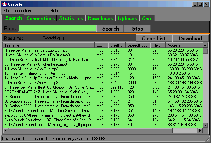
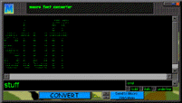
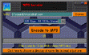
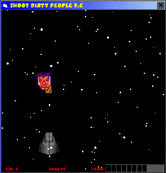

# Methodus 3 Screenshot Gallery

These are recovered original Methodus 3 web/site screenshots preserved directly in this repository.

## Crapster

Original filename: `crapster2.gif`

## Font-to-Macro Converter

Original filename: `macrofont2.gif`

## WAV / MP3 Encoder

Original filename: `mp3enc2.gif`

## Built-in game

Original filename: `dirty2.gif` — recovered from the original Methodus 3 screenshot folder.

More images from the recovered Methodus2000 screenshot folder are being added as they are verified and copied from the archive.

> Historical screenshots are preserved for software-history and digital-preservation research. Some Methodus features reflected AOL-era security/abuse culture; this archive documents them without providing misuse instructions.
