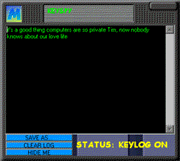

# Methodus 3 Screenshot Gallery

These are recovered original Methodus 3 web/site screenshots preserved directly in this repository and checked against the recovered file sizes.

## Crapster

Original filename: `crapster2.gif`

## KeySpy

Original filename: `keyspy2.gif`

## Font-to-Macro Converter

Original filename: `macrofont2.gif`

## WAV / MP3 Encoder

Original filename: `mp3enc2.gif`

## Shoot Dirty People Game

Original filename: `dirty2.gif`

Additional verified originals remain in the recovered Methodus2000 screenshot folder and will be added only after their repository byte count matches the recovered source.

> Historical screenshots are preserved for software-history and digital-preservation research. Some Methodus features reflected AOL-era security/abuse culture; this archive documents them without providing misuse instructions.
